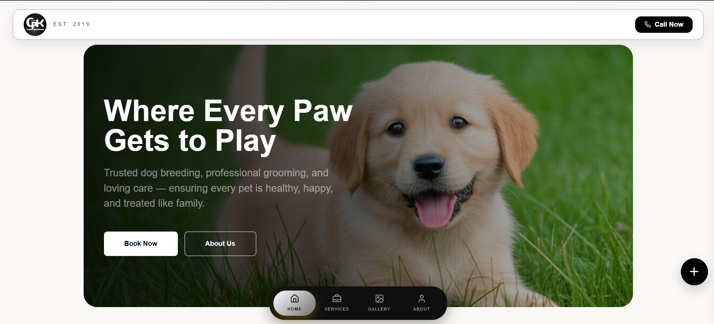

# 🚖 Cherry Paws Kennel

<p align="center">
  <strong>A premium Progressive Web Application (PWA) built with React.js, featuring a modern taxi booking experience, responsive UI, smooth micro-interactions, third-party API integration for location autocomplete, and performance-focused frontend architecture.</strong>
</p>

<p align="center">


</p>

---

## 🌍 Live Preview

[](https://cherrypawskennel.netlify.app/)

🔗 **Live Website:** https://cherrypawskennel.netlify.app/

# ✨ Overview

**Cherry Paws Kennel** is a modern, production-ready frontend application designed to provide a premium digital experience for dog breeding, puppy adoption, and professional pet care services.

The project follows modern React architecture with reusable components, responsive layouts, polished animations, and Progressive Web App (PWA) capabilities to deliver a seamless experience across desktop, tablet, and mobile devices.

 It showcases available dog breeds, kennel services, puppy care information, and an intuitive user interface that helps visitors explore trusted breeding and pet care solutions with ease.

---

# ⚙️ Technology Stack

| Technology             | Usage                                    |
|------------------------|------------------------------------------|
| ⚛️ React.js            | Frontend Development                     |
| 🟨 JavaScript (ES6+)   | Application Logic                        |
| 🎨 Bootstrap 5         | Responsive Grid & UI Components          |
| 💅 CSS3                | Custom Styling & Responsive Design       |
| 🎭 Framer Motion       | Animations & Micro-interactions          |
| 🎯 Lucide React        | Modern SVG Icons                         |
| 📱 Progressive Web App | Installable Web Application              |
| 🔧 Git & GitHub        | Version Control & Source Management      |

---
# 📂 Folder Structure

```text
cherrypawskennel/
├── public/
├── screenshots/
├── src/
│   ├── assets/
│   ├── components/
│   ├── pages/
│   ├── hooks/
│   ├── routes/
│   ├── services/
│   ├── utils/
│   ├── App.jsx
│   └── main.jsx
├── styles/
├── package.json
├── vite.config.js
└── README.md
```

---
# 🖥️ Features

### 🐶 Core Features

* Premium Hero Section
* Dog Breeds Showcase
* Puppy Care Information
* Customer Testimonials
* Contact & Inquiry Form
* Fully Responsive Design

---

### ⚡ Performance

* Fast Loading
* Optimized Components
* Installable PWA
* Mobile Friendly

---

### 🎨 UI

* Modern React UI
* Smooth Animations
* Glassmorphism Effects
* Clean & Responsive Layout


# 🚀 Getting Started

```bash
git clone https://github.com/prabhatrana666/cherrypawskennel.git

cd cherrypawskennel

npm install

npm run dev
```

Production Build

```bash
npm run build
```

---

---

# 👨‍💻 Developer

**Prabhat Rana**

Frontend Developer

GitHub → https://github.com/prabhatrana666

LinkedIn → https://linkedin.com/in/prabhat-rana

Portfolio → https://prabhatrana.netlify.app/

---

# ⭐ Support

If you found this project helpful, consider giving it a **Star ⭐**.

It helps others discover the project and motivates future improvements.

---

<p align="center">

Made with ❤️ using React.js by Prabhat Rana

</p>
